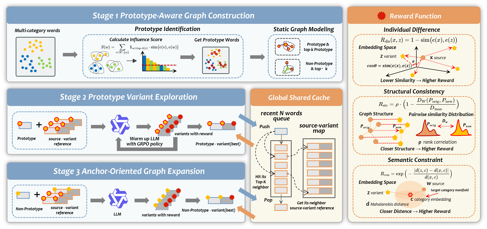

<div align="center">

# PGPO: Prototype-Guided Progressive Obfuscation for Privacy-Preserving LLM-Enhanced Recommendation

[Shengxiang Lin](https://Shengxiang-Lin.github.io/)<sup>1</sup>, 
[Jiajie Su](https://scholar.google.com/citations?hl=zh-CN&user=tn09CCIAAAAJ&view_op=list_works&sortby=pubdate)<sup>1</sup>, 
[Pengyang Zhou](https://scholar.google.com/citations?hl=zh-CN&user=3LnDqE4AAAAJ&view_op=list_works&sortby=pubdate)<sup>1</sup>, 
[Xiang Chen](https://scholar.google.com/citations?user=ZMdsjDUAAAAJ&hl=zh-CN&oi=sra)<sup>1</sup>, 
[Xiaolin Zheng](https://person.zju.edu.cn/xlzheng#0)<sup>1,&#42;</sup>, 
[Feng Tian](https://www.xjtu.edu.cn/jsnr.jsp?wbtreeid=1632&wbwbxjtuteacherid=1473)<sup>2,&#42;</sup>,
[Chaochao Chen](https://person.zju.edu.cn/zjuccc)<sup>1</sup>

<sup>1</sup>[Zhejiang University](https://www.zju.edu.cn/), 
<sup>2</sup>[Xi'an Jiaotong University](https://www.xjtu.edu.cn/) 

<sup>&#42;</sup> Corresponding Authors

</div>
 

<p align="center">
  
  
  
  </a>
  
</p>

PGPO is a privacy-preserving framework for LLM-enhanced recommendation. It constructs a vocabulary-level semantic graph, identifies high-influence prototype words, learns privacy-preserving prototype variants with Group Relative Policy Optimization, and progressively propagates the learned obfuscation structure to the remaining vocabulary.

The repository provides the complete pipeline for data preparation, semantic graph construction, prototype extraction, GRPO training, privacy-preserving variant generation, and downstream evaluation on MovieLens-1M and Amazon-Book.

## 📰 News

- **[Coming Soon]** The arXiv preprint and citation information will be released soon. Stay tuned.
- **[2026.08]** 🎉 PGPO is accepted to EMNLP 2026 as a Main Conference paper.
- **[2026.06]** The PGPO implementation and evaluation pipeline are publicly available.

## 🏗️ Architecture

<p align="center">
  
</p>

<p align="left"><b>Figure 1.</b> Overview of PGPO. High-influence prototype words are first identified, and a vocabulary-level static semantic graph is constructed. The LLM then explores prototype obfuscation anchors under GRPO-based reward optimization and propagates them through the graph to the remaining vocabulary.</p>

## 📄 Paper

The arXiv preprint is being prepared and will be released soon. **Stay tuned.**

## ✨ Key Features

- **Prototype-aware semantic graph**: identifies structurally influential words and precomputes vocabulary-level semantic neighborhoods.
- **GRPO-based variant exploration**: jointly optimizes semantic displacement, relational fidelity, and category validity.
- **Progressive graph expansion**: propagates reliable prototype mappings from the semantic core to the full vocabulary.
- **Context-aware generation cache**: uses finalized neighboring mappings as structural anchors during training and generation.
- **End-to-end evaluation**: supports generation-quality analysis, recommendation evaluation, embedding inversion, and white-box source re-identification.

## 📁 Project Structure

```text
PGPO/
├── data/                              # Raw and processed datasets
├── base_models/                       # Locally downloaded pretrained models
├── generate_edges/                    # LLM-based semantic edge construction
├── models/                            # PGPO datasets, rewards, cache, generator, and trainer
├── evaluate/                          # Evaluation pipelines and documentation
│   ├── embedding/                     # Item-text embedding construction
│   ├── quality/                       # Word- and sentence-level quality evaluation
│   ├── recsys/                        # Recommendation backends
│   ├── attack/                        # Embedding inversion attacks
│   ├── w2w_attack/                    # Replay-MLE white-box re-identification
│   └── README.md                      # Complete evaluation guide
├── figs/                              # Figures used in the documentation
├── prepare_amazon_raw0.py             # Amazon-Book subset construction
├── extract_id_name.py                 # Item ID-name extraction
├── cut_item_edges.py                  # Category-aware semantic edge pruning
├── compute_embeddings.py              # Prototype embeddings and similarity statistics
├── train_grpo.py                      # PGPO training and variant generation
├── download_base_models.py            # Base-model downloader
├── requirements.txt                   # Python dependencies
└── README.md
```

## 🚀 Quick Start

### 1. Installation

```bash
git clone https://github.com/Shengxiang-Lin/PGPO.git
cd PGPO

conda create -n pgpo python=3.10 -y
conda activate pgpo
pip install -r requirements.txt
```

### 2. Download Base Models

```bash
mkdir -p base_models
python download_base_models.py
```

The downloader currently fetches Qwen3-4B-Base. Other models used by particular stages, such as BERT-base-uncased, Qwen2.5-14B-Instruct, T5-base, or a recommendation LLM, should be placed under `base_models/` or supplied through the corresponding command-line path argument.

### 3. Prepare Raw Data

#### MovieLens-1M

Download [MovieLens-1M](https://grouplens.org/datasets/movielens/1m/), extract `ratings.dat`, `movies.dat`, and `users.dat`, and place them under:

```text
data/ml-1m/raw/
```

#### Amazon-Book

Download [Books.csv](https://mcauleylab.ucsd.edu/public_datasets/data/amazon_v2/categoryFilesSmall/Books.csv) and [meta_Books.json.gz](https://jmcauley.ucsd.edu/data/amazon_v2/metaFiles2/meta_Books.json.gz), and place them under:

```text
data/amazon-book/raw/
```

### 4. Run Data Preprocessing

#### MovieLens-1M

```bash
cp -r data/ml-1m/raw data/ml-1m/raw-0
python extract_id_name.py --dataset ml-1m
python generate_edges/generate_edges_local.py --dataset ml-1m
python cut_item_edges.py --dataset ml-1m
python compute_embeddings.py --dataset ml-1m
```

#### Amazon-Book

```bash
python prepare_amazon_raw0.py --dataset amazon-book
python extract_id_name.py --dataset amazon-book
python generate_edges/generate_edges_local.py --dataset amazon-book
python cut_item_edges.py --dataset amazon-book
python compute_embeddings.py --dataset amazon-book
```

The preprocessing pipeline produces cleaned semantic edges, fine-grained vocabulary entries, prototype influence scores, embeddings, and neighborhood similarity files under `data/<dataset>/handled/`.

## 🏋️ PGPO Training

Train and generate variants for MovieLens-1M:

```bash
python train_grpo.py --dataset movielens
```

Train and generate variants for Amazon-Book:

```bash
python train_grpo.py --dataset amazon-book
```

A configurable example is shown below:

```bash
python train_grpo.py \
  --dataset movielens \
  --model_name_or_path ./base_models/Qwen3-4B-Base \
  --learning_rate 5e-7 \
  --batch_size 2 \
  --num_generations 8 \
  --max_steps 5000 \
  --use_cache 2000
```

Default outputs are written to:

```text
output/grpo_model/movielens/
output/grpo_model/amazon-book/
output/generated_variants_movielens.json
output/generated_variants_amazon-book.json
```

## 📦 Model Weights

The trained model weights on MovieLens-1M and Amazon-Book are available at [🤗](https://huggingface.co/Shengxiang-Lin/PGPO)

## 📊 Evaluation

Evaluation instructions are detailed in **[evaluate/README.md](evaluate/README.md)**. The guide covers:

- semantic and obfuscated item-embedding construction;
- word- and sentence-level variant quality;
- SASRec, LightGCN, FREEDOM, LightGT, TALLRec, and LLaRA evaluation;
- Vec2Text-style embedding inversion;
- Replay-MLE-NoHistory white-box source re-identification.

## 📄 License

This project is licensed under the [MIT License](LICENSE).

## 📧 Contact

For questions and collaborations, please contact:

- Shengxiang Lin: [reallinshengxiang@gmail.com](mailto:reallinshengxiang@gmail.com)

## 🙏 Acknowledgments

This repository builds on open-source resources and models including [Qwen](https://github.com/QwenLM/Qwen), [Unsloth](https://github.com/unslothai/unsloth), [TALLRec](https://github.com/SAI990323/TALLRec), [LLaRA](https://github.com/ljy0ustc/LLaRA), [RecBole](https://github.com/RUCAIBox/RecBole), [LightGT](https://github.com/iLearn-Lab/SIGIR23-LightGT), [MMRec](https://github.com/enoche/MMRec) and [Vec2Text](https://github.com/vec2text/vec2text).

## 📚 Citation

The BibTeX entry will be provided when the arXiv preprint is released. **Stay tuned.**
